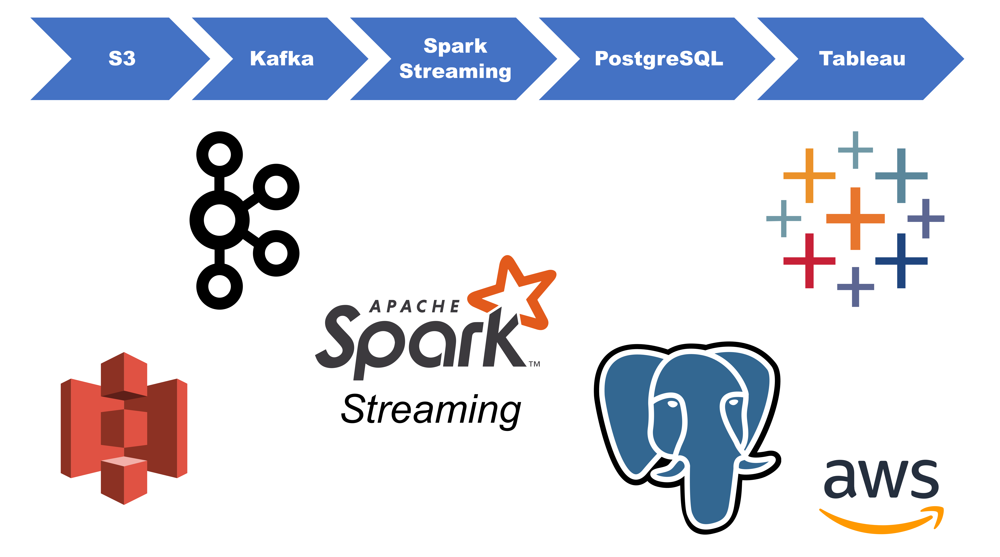

# **CardioGrip** *--Pulse Diagnosis at Your Fingertips*
### **Da Yang** - Insight Fellow in Data Engineering (Silicon Valley, Summer 2020)
The overwhelming need for telemedicine has inspired this project.
To ease the pain of transmitting ECG and other biomarker data over video conferencing platforms during doctor's virtual visits, I build a supplemental data pipeline.
The potential to collect the data generated and reduce associated network usage can be desirable.

## Objective
The goal is near real-time processing and forwarding electrocardiography (ECG or EKG) data to care providers.
At the same time, these data are aggregated (data aggregation can be electively disabled).

## Approach
This pipeline is built for aggregating, enriching, and communicating these data.
A simulated real-time data source, based on an existing dataset that contains ECG data, is used.
The original data are continuous ECG waves that are break into small (~15 min.) segments.
These segments are packaged in the json format.
Each json object is produced as a message and sent to a Kafka cluster.
EC2 nodes subscribes to the Kafka cluster and extract features from the data received.
For the current project, the time locations of the P T and QRS peaks are the only features being extracted (see figure below).  
  
The signal segment, along with features extracted, is put in a PostgreSQL database.
Near real-time queries are run behind a Dash webapp.

## Pipeline
 
1.	There are 7,511 simulated patients, with their ECG data stored as 7,511 json objects in an AWS S3 Bucket.
In each json object ("file"), there are many separate json structures with identical schema.
Each structure contains the signal of one R-peak-to-R-peak heartbeat.
The typical size of the structures is 3 kB.
2.	Kafka-python producer programs are run on EC2 instances.
Those producer programs send those structures as messages to a three-broker Kafka cluster.
The data from one subject is published to one Kafka topic, and vice versa.
3.	Python scripts subscribe to a "pattern" of topics from the Kafka cluster and consume the data received as a direct stream.
For each segment of ECG signals P, T, Q, and S are time-wise located.
Then, all together, put into a PostgreSQL database.
4.	A Dash webapp is utilized to simulate the experience of the remote care provider.
Tableau dashboards are used to visualize aggregated data.

## Demo
[Youtube Link]( https://www.youtube.com/watch?v=HSC9m9Lz-PM)

## Challenges
### [x] Kafka-producer connection reliability
The Kafka would occasionally lose over half the messages sent by the producer program.
I speculate the cause being this project does not use dedicated hardware, and the page cache is not reliable enough on every instance used.
The workaround I implemented is, for every 500 messages produced by a producer program, the thread sleep for 1 ms.

### [ ] Processing consecutive segments of signals
Many QRS analysis algorithms have been developed since the invention of the ECG machine over a century ago.
Those algorithms are developed for signal segments with R peak in the middle.
The precision resulted in this project is not ideal.

## Data Source
The data source used in this project is created based on an existing data set available from PhysioNet.org.
A description of the original dataset and of preparing the data source is given in [Data Source/README.md]( Data Source/README.md).
After preprocessing, the data source is moved to a S3 bucket.

A .csv file with about 1.75 million rows has been used for testing.
It can be found at [https://healthdata.gov/dataset/health-care-provider-credential-data]( https://healthdata.gov/dataset/health-care-provider-credential-data)

## Repo Structure
```
├── README.md     
|
├── set_up
|   └── anote_cluster.sh            cluster set-up parameters.
|   └── anote_distributions.sh      distributions of the software used.
|   └── setup_get_dev_tools.sh      get "Development Tools".
|   └── setup_ ____ _node.sh        setup a specific EC2 node.
|   └── setup_ ____ _node.txt       notes for setting up the node.
|
├── sh   
|   └── anote_cluster.sh            cluster set-up parameters.
|   └── anote_distributions.sh      distributions of the software used.
|   └── create_kafka_topics.sh      batch creation of Kafka topics.
|   └── delete_kafka_topics.sh      batch deletion of Kafka topics.
|   └── run_ ____.sh                run a specific function.
|
├── src  
|   └── ____.py                     python source code.
|
├── data_source  
|   └── README.md  
|   └── preprocessing.py            generating the data source   
|   └── ecg-sample.json             a sample file of the data generated   
```
